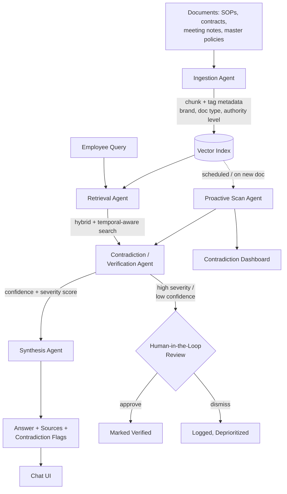

# Think9 Brain

**A centralized institutional-memory and decision-velocity agent for 30+ brands.**

Submitted for the Think9 AI & Intelligence Challenge — Track 3 (Decision Velocity & Institutional Memory).

Think9 Brain is a multi-agent RAG system that doesn't just answer questions from
internal documents — it continuously cross-references brand-level policies against
group-level policy and flags contradictions before they become legal, financial,
or brand-trust risks, with a human reviewer in the loop for anything high-stakes.

---

## Table of Contents

1. [The Problem & Opportunity](#1-the-problem--opportunity)
2. [System Architecture & Workflow](#2-system-architecture--workflow)
3. [Proof of Concept](#3-proof-of-concept)
4. [Implementation Plan](#4-implementation-plan)
5. [Quick Start](#quick-start)
6. [Repository Structure](#repository-structure)
7. [Differentiators / What's Next](#differentiators--whats-next)

---

## 1. The Problem & Opportunity

As Think9 scales past 30 brands, the knowledge that drives daily execution —
meeting notes, legal playbooks, vendor agreements, brand SOPs, and past decisions —
lives scattered across drives, chat threads, and individual memory. Two failure
modes compound as brand count grows:

- **Fragmentation** — new team members, and even founders, re-litigate decisions
  that were already made, because there's no single place to ask *"what did we
  decide about X, and why?"*
- **Silent contradictions** — one brand's vendor contract, pricing policy, or
  return policy can quietly conflict with a master agreement or with another
  brand's terms, and nobody notices until it becomes a legal or financial problem.

Search tools and static wikis only solve retrieval — they don't reason across
documents, don't detect when two sources disagree, and don't get more valuable
as the corpus grows. A generic chatbot answers questions but doesn't flag risk.

**The opportunity:** a system that does three things a keyword search can't —
continuously ingest institutional knowledge across brands, cross-reference new
information against everything that came before to catch contradictions early,
and route only the genuinely uncertain or high-stakes cases to a human — so
decision velocity increases without sacrificing accuracy or compliance.

---

## 2. System Architecture & Workflow



**Agents:**

| Agent | Responsibility |
|---|---|
| **Ingestion** | Parses documents (SOPs, contracts, meeting notes, master policies), chunks them, and tags each chunk with metadata — brand, document type, date, and **authority level** (`group_policy` vs `brand_level`). |
| **Retrieval** | On a query, runs similarity search over the vector index with temporal-aware ranking, so the most recent, authoritative version of a policy surfaces first. |
| **Contradiction / Verification** | Cross-checks retrieved content for conflicts — e.g. a brand's return window undercutting the group's minimum — and assigns each flag a **confidence** and **severity** score. |
| **Synthesis** | Generates a plain-language, source-cited answer and surfaces any contradiction inline instead of silently picking one version. |
| **Proactive Scan** | Runs the same contradiction logic across the *entire* corpus, independent of any query — this is what makes the system a continuously-monitoring "Brain" rather than a reactive Q&A bot. Designed to run nightly or on every new document ingested. |
| **Human-in-the-Loop** | Any high-severity contradiction or low-confidence answer is routed to a reviewer for approve/dismiss; the decision feeds back into future retrieval ranking. |

An optional **MCP layer** (document-source, verification, notification servers)
lets the same Brain be reached from Slack or email without a new integration
per brand.

---

## 3. Proof of Concept

This repo is a working, runnable prototype — not just a diagram.

- **Data:** `data/` contains 10 mock Think9-style documents — brand policies for
  BrandA–D, two group-level policies (Master Franchise Agreement, Master
  Procurement Policy), meeting notes, and an HR doc. **Two real contradictions
  are seeded in** so the system's detection can be verified end-to-end:
  - BrandB's 7-day return window vs. the group's 15-day minimum (Section 4.2)
  - BrandC's Net-45 vendor payment terms vs. the group's Net-30 policy
- **Retrieval + Q&A:** ask a natural-language question, get a sourced answer.
- **Contradiction detection:** numeric policy comparison (day-counts, payment
  terms) across brand-level vs. group-level documents, with confidence +
  severity scoring — not a keyword match, an actual structured comparison.
- **Proactive scan:** a full-corpus scan (no query needed) surfaces *every*
  contradiction in the corpus at once — in testing this found 6 conflicts
  (2 high, 4 medium) vs. 2 found through reactive querying alone.
- **Human-in-the-loop:** every flagged contradiction can be approved or
  dismissed from the UI, simulating a reviewer's decision.

> Demo video: **[add link here before submitting]**
> Live/local demo: run locally with the Quick Start below.

---

## 4. Implementation Plan

### Tech Stack

| Layer | Technology | Notes |
|---|---|---|
| Orchestration | LangGraph-style multi-agent flow (ingestion → retrieval → verification → synthesis, conditional routing) | This POC implements the same agent boundaries directly in Python for zero-dependency portability |
| Embeddings / Retrieval | TF-IDF (scikit-learn) in this POC | Swap for multilingual sentence-transformers + a proper ANN index at scale — retrieval interface is unchanged |
| Vector store / DB | Local pickle index in this POC | Production: Supabase (Postgres + pgvector) with row-level security per brand/department |
| Backend | FastAPI | `/query`, `/scan-all`, `/flag-review` |
| Generation | Claude API (optional) | Falls back to a deterministic template with zero API keys, so the POC runs anywhere |
| Frontend | Single-file HTML/JS in this POC | Production: React + Vite + Tailwind |
| Extensibility | — | MCP servers (document-source, verification, notification) for Slack/email access without rebuilding integrations per brand |

### 30-Day Roadmap to MVP

| Week | Focus | Key Deliverable |
|---|---|---|
| **Week 1** | Requirements & data audit: select 2–3 pilot brands, collect real meeting notes, SOPs, legal playbooks, vendor contracts; define metadata taxonomy. | Pilot data corpus + schema |
| **Week 2** | Build production ingestion pipeline (multilingual embeddings, metadata tagging); stand up Supabase/pgvector; ship retrieval + Q&A on pilot corpus. | Working RAG Q&A for pilot brands |
| **Week 3** | Harden the contradiction/verification agent; build the reviewer dashboard for HITL approval; wire the proactive nightly scan; feed reviewer decisions back into ranking. | Contradiction detection + dashboard live |
| **Week 4** | Pilot rollout to real employees in 2–3 brands; collect usage feedback; tune thresholds; scope MCP-based Slack/email access; draft rollout plan for remaining brands. | Pilot in production + scale-up plan |

By day 30, Think9 Brain answers real queries and proactively surfaces real
contradictions for 2–3 pilot brands, with a data-informed plan to extend to
the remaining 27+.

---

## Quick Start

```bash
pip install -r requirements.txt
python ingest.py                        # builds index.pkl from data/
uvicorn app:app --reload --port 8000
```

Open `http://localhost:8000` and either:
- Ask: *"What is BrandB's return policy and is it compliant?"*
- Ask: *"What are BrandC's vendor payment terms?"*
- Or click **"Scan entire corpus"** to see every contradiction in the corpus at once.

### Optional — real LLM-generated answers

By default, answers use a deterministic template (zero API keys / zero network
calls needed). For natural-language, cited answers via Claude:

```bash
export ANTHROPIC_API_KEY=sk-ant-...
```

---

## Repository Structure

```
think9poc/
├── data/                    # 10 mock documents, 2 seeded contradictions
├── ingest.py                # Ingestion agent — chunk, tag metadata, build index
├── rag.py                   # Retrieval + Contradiction/Verification + Synthesis agents
├── app.py                   # FastAPI backend — /query, /scan-all, /flag-review
├── static/index.html        # Single-file frontend (chat + proactive dashboard)
├── requirements.txt
└── README.md
```

---

## Differentiators / What's Next

- **Proactive, not just reactive** — the `/scan-all` endpoint monitors the whole
  corpus continuously rather than waiting to be asked, which is the actual
  bottleneck Think9 described (*"market research is usually static, slow, and
  reactive"* applies just as much to internal knowledge).
- **Temporal drift detection (planned)** — the meeting-notes doc in this repo
  already shows the pattern: a policy exception approved as "temporary" that
  was *never reviewed for renewal*. A next iteration flags exceptions that have
  silently gone stale, not just documents that actively conflict.
- **What-if simulation (planned)** — before a brand finalizes a policy change,
  query the Brain with a hypothetical ("if BrandE moves to a 10-day return
  window, what does it conflict with?") to catch risk *before* it's written
  down, not after.