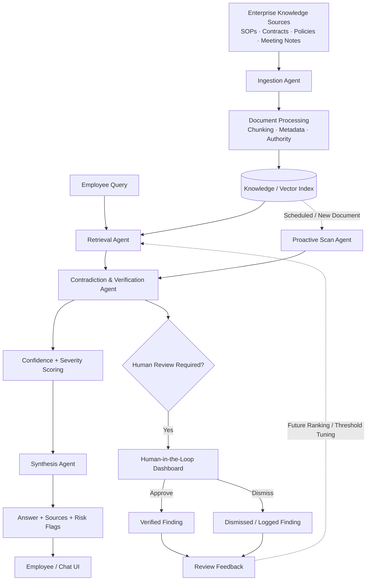

# 🧠 Think9 Brain

### Institutional Memory & Decision Intelligence for Multi-Brand Organizations

> **Think9 Brain turns fragmented organizational knowledge into an active decision-support system — retrieving institutional knowledge, verifying policies across organizational levels, and proactively surfacing contradictions before they become business risks.**

**Think9 AI & Intelligence Challenge · Track 3 — Decision Velocity & Institutional Memory**

---

## Overview

As organizations scale across multiple brands, teams, documents, and operating units, critical knowledge becomes increasingly fragmented.

A policy may exist in a brand SOP.
A different rule may exist in a group-level agreement.
A decision may only exist inside meeting notes.
And the person who remembers why that decision was made may no longer be available.

Traditional search and document chat systems solve only part of the problem:

> **They retrieve information when someone asks. They don't continuously reason across the information that already exists.**

**Think9 Brain** is a multi-agent RAG-based decision intelligence prototype designed to address this gap.

It combines:

* 🔎 **Institutional-memory retrieval**
* 🧩 **Cross-document contradiction detection**
* 🚨 **Proactive corpus-wide monitoring**
* 🧑‍⚖️ **Human-in-the-loop verification**
* 📚 **Source-aware answers**
* 🏢 **Brand-level and group-level policy reasoning**

The result is a system designed to help teams **find what was decided, understand why it was decided, detect when policies disagree, and escalate uncertain or high-impact cases to humans.**

---

# 1. The Problem

## Organizational knowledge becomes fragmented as companies scale

For a multi-brand organization, institutional knowledge can live across:

* Brand SOPs
* Legal agreements
* Vendor contracts
* Procurement policies
* Meeting notes
* HR documents
* Pricing policies
* Historical decisions
* Internal communications

This creates two major failure modes.

### 1.1 Fragmented institutional memory

Teams repeatedly ask questions such as:

> *"What did we decide about this?"*

> *"Which policy is currently applicable?"*

> *"Why was this exception approved?"*

Without a centralized reasoning layer, employees may have to search multiple systems or rely on individual memory.

This slows decision-making and increases the probability of inconsistent execution.

---

### 1.2 Silent policy contradictions

A brand-level policy can unintentionally diverge from a group-level requirement.

For example:

```text
Group Policy
     │
     ├── Minimum return window: 15 days
     │
     ▼
Brand Policy
     │
     └── Return window: 7 days
```

Neither document is necessarily difficult to retrieve.

The real problem is recognizing that:

> **These two pieces of information disagree.**

That requires cross-document reasoning rather than simple retrieval.

---

# 2. The Opportunity

Think9 Brain is designed around a simple principle:

> **The value of organizational knowledge increases when the system can reason across it — not merely search it.**

The system therefore operates in two modes:

### Reactive Intelligence

An employee asks a question.

```text
Question
   ↓
Retrieve relevant knowledge
   ↓
Verify against related policies
   ↓
Detect contradictions
   ↓
Generate sourced answer
```

### Proactive Intelligence

Nobody asks a question.

```text
Entire Knowledge Corpus
        ↓
Cross-document analysis
        ↓
Contradiction detection
        ↓
Severity + confidence scoring
        ↓
Human review
        ↓
Verified institutional knowledge
```

This second capability is the key differentiator of the prototype.

---

# 3. System Architecture



---

# 4. Agent Architecture

| Agent                                  | Responsibility                                                                                                      |
| -------------------------------------- | ------------------------------------------------------------------------------------------------------------------- |
| **Ingestion Agent**                    | Processes documents, creates chunks, and attaches metadata such as brand, document type, date, and authority level. |
| **Retrieval Agent**                    | Finds relevant institutional knowledge for employee questions using the indexed corpus.                             |
| **Contradiction / Verification Agent** | Cross-references related sources and identifies conflicting policies, values, or statements.                        |
| **Synthesis Agent**                    | Converts retrieved and verified information into a concise, source-aware response.                                  |
| **Proactive Scan Agent**               | Runs contradiction detection across the complete corpus without requiring an employee query.                        |
| **Human-in-the-Loop Agent**            | Routes high-severity or low-confidence findings to a reviewer for approval or dismissal.                            |

### Authority-aware reasoning

The prototype distinguishes between different levels of organizational authority:

```text
Group Policy
     ↓
Master Agreement
     ↓
Brand Policy
     ↓
Operational Exception
```

This allows contradiction detection to become more meaningful than simple text similarity.

A conflict between two equally authoritative documents is different from a brand-level policy conflicting with a group-level requirement.

---

# 5. Core Workflow

## 5.1 Document ingestion

Documents are processed into searchable knowledge units.

```text
Document
   ↓
Parsing
   ↓
Chunking
   ↓
Metadata extraction
   ↓
Embedding / indexing
```

Metadata includes:

```text
brand
document_type
document_date
authority_level
source
```

---

## 5.2 Query-time reasoning

For a query such as:

> **"What is BrandB's return policy and is it compliant?"**

Think9 Brain:

1. Retrieves BrandB's policy.
2. Identifies the relevant group-level policy.
3. Compares the two.
4. Calculates confidence and severity.
5. Returns the answer with the relevant contradiction.

This avoids the common failure mode of simply returning the first matching document.

---

## 5.3 Proactive contradiction scanning

The `/scan-all` workflow does not require an employee query.

Instead:

```text
All indexed documents
        ↓
Generate relevant document relationships
        ↓
Compare policy constraints
        ↓
Identify conflicts
        ↓
Assign severity
        ↓
Surface findings
```

This transforms the system from:

> **"Ask the chatbot when something goes wrong."**

into:

> **"Let the system continuously look for things that could go wrong."**

---

# 6. Proof of Concept

This repository contains a **fully runnable prototype** demonstrating the core workflow.

## Dataset

The included `data/` directory contains **10 mock Think9-style documents**, representing:

* Brand-level policies
* Group-level policies
* Master agreements
* Procurement rules
* Meeting notes
* HR documentation

The dataset intentionally contains seeded conflicts to validate the detection pipeline.

### Seeded contradictions

#### Example 1 — Return Policy

```text
Group minimum:
15 days

BrandB:
7 days
```

The system identifies the mismatch and evaluates its severity.

#### Example 2 — Vendor Payment Terms

```text
Group policy:
Net-30

BrandC:
Net-45
```

The system detects the deviation between the brand-level and group-level policies.

---

## Prototype capabilities

| Capability                 | Status        |
| -------------------------- | ------------- |
| Document ingestion         | ✅ Implemented |
| Metadata tagging           | ✅ Implemented |
| Retrieval                  | ✅ Implemented |
| Source-aware Q&A           | ✅ Implemented |
| Numeric policy comparison  | ✅ Implemented |
| Contradiction detection    | ✅ Implemented |
| Confidence scoring         | ✅ Implemented |
| Severity scoring           | ✅ Implemented |
| Full-corpus proactive scan | ✅ Implemented |
| Human review workflow      | ✅ Implemented |
| Temporal drift detection   | 🔜 Planned    |
| What-if policy simulation  | 🔜 Planned    |
| Production vector database | 🔜 Planned    |
| Slack / email integration  | 🔜 Planned    |

---

# 7. Proactive Scan Results

During prototype testing, the full-corpus scan surfaced:

```text
Documents scanned      : 10
Contradictions found   : 6
High severity          : 2
Medium severity        : 4
```

The important distinction is that the proactive scan found conflicts **without requiring a user to formulate a query for each one**.

> **These numbers are prototype evaluation results on the included mock corpus, not production accuracy benchmarks.**

---

# 8. Human-in-the-Loop

AI should not silently make high-impact organizational decisions.

Think9 Brain therefore treats contradiction detection as a **decision-support workflow**.

```text
Potential Contradiction
        ↓
Confidence + Severity
        ↓
   ┌────┴────┐
   ↓         ↓
Low Risk   High Risk
   ↓         ↓
Automatic   Human Review
Handling       ↓
          ┌────┴────┐
          ↓         ↓
       Approve    Dismiss
          ↓         ↓
       Verified   Logged
```

This provides a controlled path for:

* Legal-sensitive conflicts
* Financial policy mismatches
* Low-confidence detections
* Ambiguous exceptions
* High-impact organizational decisions

---

# 9. Technology Stack

| Layer                   | Prototype               | Production Direction                      |
| ----------------------- | ----------------------- | ----------------------------------------- |
| **Backend**             | FastAPI                 | FastAPI / scalable service layer          |
| **Orchestration**       | Python agent boundaries | LangGraph-style orchestration             |
| **Retrieval**           | TF-IDF / local index    | Sentence Transformers + ANN retrieval     |
| **Vector Storage**      | Local pickle index      | PostgreSQL + pgvector / managed vector DB |
| **Generation**          | Optional Claude API     | Production LLM with structured outputs    |
| **Frontend**            | HTML / CSS / JavaScript | React + Vite + Tailwind                   |
| **Document Processing** | Python                  | Production document ingestion pipeline    |
| **Human Review**        | Prototype dashboard     | Role-based review workflow                |
| **Integration**         | Local API               | Slack / Email / MCP-based interfaces      |

### Design principle

The prototype intentionally uses lightweight components so that it can run locally with minimal infrastructure.

The architecture keeps the major interfaces modular so retrieval, storage, generation, and orchestration can be upgraded independently.

---

# 10. API Surface

The prototype exposes the following core backend operations:

| Endpoint            | Purpose                                             |
| ------------------- | --------------------------------------------------- |
| `GET /`             | Serves the web application                          |
| `POST /query`       | Runs retrieval, verification, and answer synthesis  |
| `GET /scan-all`     | Performs a proactive full-corpus contradiction scan |
| `POST /flag-review` | Records a human review decision                     |

The API layer allows the frontend to remain decoupled from the underlying reasoning components.

---

# 11. Project Structure

```text
think9-brain-poc/
│
├── 📁 data/
│   ├── brand_a_policy.*
│   ├── brand_b_policy.*
│   ├── brand_c_policy.*
│   ├── brand_d_policy.*
│   ├── master_franchise_agreement.*
│   ├── master_procurement_policy.*
│   ├── meeting_notes.*
│   ├── hr_policy.*
│   └── ...
│
├── 📁 static/
│   └── index.html
│
├── 📄 app.py
│   └── FastAPI application and API endpoints
│
├── 📄 rag.py
│   └── Retrieval, verification, contradiction detection,
│       synthesis, and proactive scanning logic
│
├── 📄 ingest.py
│   └── Document ingestion, chunking, metadata processing,
│       and index generation
│
├── 📄 requirements.txt
│   └── Python dependencies
│
├── 📄 README.md
│   └── Project documentation
│
└── 📄 index.pkl
    └── Generated local retrieval index
```

> `index.pkl` is a generated artifact and can be rebuilt from `data/` using the ingestion pipeline.

---

# 12. Quick Start

## Prerequisites

* Python 3.10+
* pip
* Git

---

## Installation

Clone the repository:

```bash
git clone https://github.com/AatifaRizvi/think9-brain-poc.git
cd think9-brain-poc
```

Create a virtual environment:

### Windows

```powershell
python -m venv .venv
.venv\Scripts\activate
```

### macOS / Linux

```bash
python3 -m venv .venv
source .venv/bin/activate
```

Install dependencies:

```bash
pip install -r requirements.txt
```

---

## Build the knowledge index

```bash
python ingest.py
```

This processes the documents in `data/` and generates the local retrieval index.

---

## Start the application

```bash
uvicorn app:app --reload --port 8000
```

Open:

```text
http://localhost:8000
```

---

# 13. Try the Demo

### Query-based workflow

Try:

```text
What is BrandB's return policy and is it compliant?
```

Or:

```text
What are BrandC's vendor payment terms?
```

---

### Proactive workflow

Click:

> **Scan Entire Corpus**

The system will analyze the available corpus and display detected contradictions along with their severity and confidence.

### Recommended demo sequence

```text
1. Ask a policy question
        ↓
2. Show retrieved sources
        ↓
3. Show contradiction detection
        ↓
4. Open Proactive Scan
        ↓
5. Scan entire corpus
        ↓
6. Show contradiction dashboard
        ↓
7. Review / approve a finding
```

This demonstrates the difference between **reactive RAG** and **proactive institutional intelligence**.

---

# 14. Optional LLM Generation

The prototype can operate without an external API key using deterministic answer generation.

For LLM-powered natural-language synthesis, configure the appropriate API key as an environment variable:

```powershell
$env:ANTHROPIC_API_KEY="your_api_key"
```

Then restart the application.

> Never commit API keys or `.env` files to GitHub.

---

# 15. 30-Day MVP Roadmap

| Timeline   | Focus                               | Deliverable                                                     |
| ---------- | ----------------------------------- | --------------------------------------------------------------- |
| **Week 1** | Data audit + pilot selection        | 2–3 pilot brands, document taxonomy, access model               |
| **Week 2** | Production ingestion + retrieval    | Multilingual embeddings, metadata pipeline, pgvector            |
| **Week 3** | Verification + proactive monitoring | Contradiction engine, reviewer dashboard, scheduled scans       |
| **Week 4** | Pilot deployment                    | Employee testing, threshold tuning, feedback loop, rollout plan |

### Target MVP outcome

By the end of the first 30 days:

> **Think9 Brain should operate on real organizational knowledge for 2–3 pilot brands, continuously surface potential contradictions, and provide a measurable decision-support workflow for employees and reviewers.**

---

# 16. Production Architecture

The POC is intentionally lightweight. A production deployment would evolve toward:

```text
                   ┌─────────────────────┐
                   │ Enterprise Sources  │
                   │ Drive / Email / CRM  │
                   │ Slack / Documents    │
                   └──────────┬──────────┘
                              ↓
                   ┌─────────────────────┐
                   │ Ingestion Pipeline  │
                   │ Parse + Chunk + ACL │
                   │ Metadata + Versioning│
                   └──────────┬──────────┘
                              ↓
              ┌──────────────────────────────┐
              │     Knowledge Layer          │
              │                              │
              │ PostgreSQL + pgvector        │
              │ Metadata + Permissions       │
              │ Document Versions             │
              └──────────────┬───────────────┘
                             ↓
                  ┌──────────────────────┐
                  │ Reasoning Layer      │
                  │                      │
                  │ Retrieval             │
                  │ Verification          │
                  │ Contradiction Engine  │
                  │ Synthesis             │
                  └──────────┬───────────┘
                             ↓
              ┌────────────────────────────┐
              │ Decision Intelligence      │
              │                            │
              │ Answers                    │
              │ Risk Flags                 │
              │ Proactive Alerts           │
              └────────────┬───────────────┘
                           ↓
              ┌────────────────────────────┐
              │ Human Review & Governance  │
              │                            │
              │ Approve / Dismiss / Audit  │
              └────────────────────────────┘
```

---

# 17. Security & Governance Considerations

A production implementation must treat organizational knowledge as sensitive infrastructure.

Key requirements include:

* **Role-based access control**
* **Brand-level data isolation**
* **Document-level permissions**
* **Source attribution**
* **Audit logs**
* **Document versioning**
* **Reviewer accountability**
* **PII and sensitive-data controls**
* **Model-output monitoring**
* **Human approval for high-impact decisions**

The prototype does not claim to implement enterprise-grade security controls; these belong in the production implementation layer.

---

# 18. Differentiators

### 01 — Proactive instead of purely reactive

Traditional RAG:

```text
User → Question → Retrieval → Answer
```

Think9 Brain:

```text
Documents → Continuous Verification → Risk Detection
```

---

### 02 — Cross-document reasoning

The system does not treat every document as an isolated knowledge source.

It explicitly compares:

```text
Group Policy
      ↕
Brand Policy
      ↕
Operational Exception
      ↕
Historical Decision
```

---

### 03 — Risk-aware outputs

Instead of returning only an answer:

```text
Answer
+
Sources
+
Contradiction
+
Confidence
+
Severity
```

This makes the output more useful for decision-making.

---

### 04 — Human-controlled intelligence

The objective is not to replace organizational judgment.

It is to:

> **surface the right information and the right risks at the right time.**

---

# 19. What's Next

## Temporal Drift Detection

Organizations often create temporary exceptions that quietly become permanent.

Future versions will detect:

```text
Temporary Exception
        ↓
Expiration / Review Date
        ↓
No Review
        ↓
Potential Policy Drift
```

This moves the system beyond contradiction detection toward **institutional memory maintenance**.

---

## What-If Policy Simulation

Before publishing a policy change, users could ask:

> *"If BrandE moves to a 10-day return window, what policies would this conflict with?"*

The system would simulate the proposed change against the organizational knowledge graph and identify potential conflicts **before deployment**.

---

## Enterprise Integrations

Potential interfaces include:

* Slack
* Email
* Google Drive
* Microsoft 365
* Internal knowledge bases
* MCP-based enterprise tools

The goal is to make institutional intelligence available **where decisions already happen**.

---

# 20. Limitations of the Current POC

This repository is a proof of concept and intentionally does not represent a production deployment.

Current limitations include:

* Mock / synthetic dataset
* Lightweight local retrieval
* No enterprise authentication
* No production-grade access-control layer
* No distributed vector database
* Limited document formats
* Prototype-level contradiction rules
* No production monitoring infrastructure
* No benchmark against a real enterprise corpus

These limitations are deliberate and define the next engineering phase rather than hidden assumptions.

---

# 21. Success Metrics for Production

A production rollout should be evaluated using measurable business and system metrics.

### Retrieval

* Retrieval precision / recall
* Source attribution accuracy
* Answer groundedness

### Contradiction Detection

* Precision of flagged contradictions
* False-positive rate
* False-negative rate
* Reviewer acceptance rate

### Decision Velocity

* Time-to-answer
* Time saved per employee
* Reduction in repeated questions
* Time from contradiction creation → detection

### Governance

* Percentage of high-risk findings reviewed
* Audit completeness
* Policy-version traceability

The ultimate objective is not simply **more AI output**.

It is:

> **Faster, safer, and better-informed organizational decisions.**

---

# 22. Demo

🎥 **Demo Video:** *Add link before submission*

The recommended demo showcases:

1. Natural-language institutional-memory query
2. Source-aware response
3. Contradiction identification
4. Full-corpus proactive scan
5. Severity and confidence scoring
6. Human review workflow

---

# 23. Conclusion

Think9 Brain is built around a shift in how organizations use internal knowledge:

> **From searching documents → to reasoning across institutional memory.**

The prototype demonstrates that an internal RAG system can evolve beyond question answering by continuously checking organizational knowledge for contradictions, surfacing potential risks, and involving humans where judgment matters.

As Think9 scales across brands, the long-term vision is an institutional intelligence layer that helps teams:

**Remember what was decided.
Understand why it was decided.
Detect when things stop agreeing.
And make the next decision faster.**

---

## Built for the Think9 AI & Intelligence Challenge

**Track 3 — Decision Velocity & Institutional Memory**

**Think9 Brain · Institutional Memory + Proactive Decision Intelligence**
