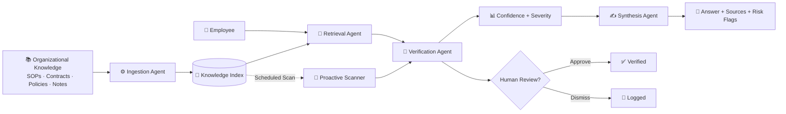

# Think9 Brain
### The Institutional Memory Layer for Multi-Brand Organizations

**Think9 AI & Intelligence Challenge · Track 3 — Decision Velocity & Institutional Memory**

[](#) [](#) [](#) [](#)

**🔗 Prototype repo:** [github.com/AatifaRizvi/think9-brain-poc](https://github.com/AatifaRizvi/think9-brain-poc)

---

Somewhere between "we have a policy for that" and "which version of that policy is actually true," most multi-brand organizations lose track of themselves. Every document is fine on its own. It's the pile of them together that starts contradicting itself, quietly, with nobody assigned to notice. Think9 Brain is built to notice.

> **In one line:** it doesn't just retrieve what a document says — it checks whether all the documents still agree with each other, and tells you before it becomes a problem.

---

## The Problem & Opportunity

At 30+ brands, Think9's knowledge is scattered across SOPs, contracts, policies, meeting notes, and vendor agreements — each maintained by a different team, updated on its own schedule, with no one checking it against the others.

Two failure modes fall out of this naturally:

- **Fragmented memory** — "What did we decide about this?" has an answer somewhere: a meeting note, a superseded doc, someone's inbox. But finding it takes longer than it should, and sometimes it just doesn't get found.
- **Silent contradictions** — a group policy sets a 15-day return window; a brand policy says 7. Both are real, both are searchable, and a normal search tool will hand you either one without ever mentioning the other exists. Nobody finds out until a customer complaint forces the question — and by then it's not a documentation problem, it's a trust problem.

**Why search alone can't fix this:** catching a contradiction means reading two documents, working out which one actually has authority, and deciding whether the gap is a real conflict or a legitimate exception. That's reasoning, not retrieval — and it needs to run continuously across the whole corpus, not just when someone happens to ask the right question.

---

## System Architecture & Workflow

Think9 Brain runs as a small chain of agents rather than one model trying to do everything. Documents get ingested and indexed once, then serve two consumers: a person asking a direct question, and a scheduled scan that checks the whole corpus without being asked anything at all.



| Agent | Role |
|---|---|
| **Ingestion** | Parses, chunks, and tags incoming documents |
| **Retrieval** | Pulls the relevant institutional knowledge for a query |
| **Verification** | Cross-checks policies against each other and flags conflicts |
| **Synthesis** | Turns retrieved + verified content into a grounded, source-aware answer |
| **Proactive Scanner** | Runs the same verification logic across the entire corpus, unprompted |
| **Human Review** | Sits between "flagged" and "confirmed" — nothing high-risk gets accepted silently |

**The key design choice:** verification isn't similarity matching, it's authority-aware. The system knows the hierarchy —

```
Group Policy  >  Master Agreement  >  Brand Policy  >  Operational Exception
```

— so it's not asking *"do these two texts look alike,"* it's asking *"do they actually agree, and if not, whose call is it?"* Anything the verification agent is unsure about — high severity, ambiguous authority — goes to a human instead of getting silently resolved. The system's job is to surface risk fast, not to be the final word on it.

---

## Proof of Concept / Prototype

The prototype runs on **10 mock organizational documents** with conflicts seeded on purpose, served through a FastAPI backend with a lightweight web front end.

**Two of the seeded conflicts:**

```
GROUP POLICY: Return window → 15 days
BRAND B:      Return window → 7 days     ⚠️ CONFLICT

GROUP PROCUREMENT: Payment terms → Net-30
BRAND C:            Payment terms → Net-45   ⚠️ CONFLICT
```

The more useful demo is the **full-corpus scan**. Instead of six separate questions to stumble onto six separate problems, one scan pulls all of them out at once:

```
PROACTIVE SCAN
────────────────────────────
Documents scanned        10
Contradictions found      6
High severity             2
Medium severity           4
```

*This is the seeded POC dataset, not a production accuracy number — it's here to show the mechanism works, not to make an accuracy claim.*

**Run it locally:**
```bash
git clone https://github.com/AatifaRizvi/think9-brain-poc.git
cd think9-brain-poc
python -m venv .venv && source .venv/bin/activate   # Windows: .venv\Scripts\activate
pip install -r requirements.txt
python ingest.py
uvicorn app:app --reload --port 8000
```
Then open `http://localhost:8000`, ask something like *"What is BrandB's return policy and is it compliant?"*, and hit **Scan Entire Corpus**.

**API surface:**

| Endpoint | Purpose |
|---|---|
| `GET /` | Web application |
| `POST /query` | RAG + verification |
| `GET /scan-all` | Proactive corpus scan |
| `POST /flag-review` | Human review |

It's API-first on purpose — today's HTML/JS front end could be swapped for React, Slack, or an internal tool without touching the reasoning layer underneath it.

---

## Implementation Plan

**Stack today (POC):**

| Layer | Technology |
|---|---|
| Backend | FastAPI |
| Retrieval | Python + TF-IDF |
| Index | Local vector/index layer |
| LLM | Claude API (optional) |
| Frontend | HTML + CSS + JavaScript |

**Stack for production:** LangGraph for agent orchestration, PostgreSQL + pgvector for the index, modern embedding models in place of TF-IDF, and direct integrations into Slack, email, and MCP so the Brain sits inside the tools where decisions already get made, instead of being one more place to check.

**30-day MVP path:**

| Week | Focus |
|---|---|
| **1** | Connect 2–3 pilot brands, pull in real knowledge sources |
| **2** | Production ingestion, embeddings, migrate to pgvector |
| **3** | Harden the contradiction engine, build the reviewer workflow |
| **4** | Pilot deployment, evaluation, tuning against real usage |

Before this touches real organizational data it also needs: role-based access control, brand-level data isolation, document versioning, audit trails, PII handling, reviewer permissions, and ongoing monitoring. None of that is required to prove the core idea — but all of it is required before the core idea is trusted with anything real.

---

## Differentiators & Future Trajectories

Most internal knowledge tools stop at retrieval — hand you the right paragraph, call it done. Think9 Brain treats retrieval as the easy part and spends its effort on the harder question underneath it: do these documents actually agree, who has the authority to settle it if they don't, and is this worth a person's time. It's also not waiting to be asked — the proactive scan means it's looking for problems on its own schedule, not just when someone thinks to check.

**Where this goes next:**

- **Temporal drift** — flagging policies that were marked "temporary" and then quietly never revisited. That's usually where the real risk sits.
- **What-if simulation** — *"what happens if Brand E moves to a 10-day return window?"* answered before the policy ships, not after.
- **Deeper integration** — living in Slack, email, Drive, Microsoft 365, and MCP, so it's part of where decisions happen rather than a separate dashboard people have to remember to open.

The underlying bet is simple: a knowledge base shouldn't just be searchable, it should be able to tell when it disagrees with itself — and say so before someone else has to find out the hard way.

---

**Think9 AI & Intelligence Challenge · Track 3 — Decision Velocity & Institutional Memory**