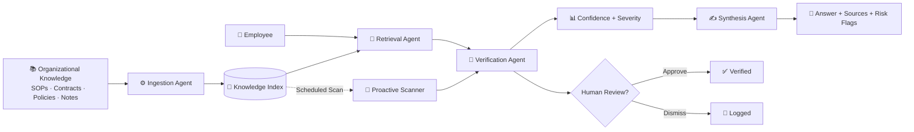

# Think9 Brain
### The Institutional Memory Layer for Multi-Brand Organizations

**Think9 AI & Intelligence Challenge · Track 3 — Decision Velocity & Institutional Memory**

[](#) [](#) [](#) [](#)

**🎥 Demo:** *[add link before submission]*

---

As Think9 scales past 30+ brands, a quiet problem builds up: nobody can say for certain what the organization has actually decided, or whether those decisions still agree with each other. Think9 Brain is our attempt at fixing that — a system that doesn't just answer "what does this document say," but tells you what was decided, whether everything still lines up, and what's worth worrying about.

---

## The Problem & Opportunity

Every fast-growing multi-brand company ends up with the same mess: SOPs, contracts, policies, meeting notes, and vendor agreements scattered across brands, each written and updated independently. Individually, every document is retrievable. Nobody's memory has actually failed. But collectively, nobody can answer "does everything still agree with itself" — because nothing is checking.

This shows up as two distinct, expensive failures:

**Fragmented memory.** Someone asks "what did we decide about this?" and the honest answer is buried in an old meeting note, a superseded policy doc, or a person who's since left the team.

**Silent contradictions.** A group policy might set a 15-day return window while a brand policy says 7. Both documents exist, both are searchable, and standard keyword or semantic search will happily return both without ever telling you they conflict. Nobody finds out until a customer complaint or an audit forces the question.

This is exactly the kind of problem that needs an agentic system rather than a smarter search bar. Finding a contradiction between two policies requires reading both, understanding which one has organizational authority, and deciding whether the gap is a real conflict or a legitimate exception — that's reasoning, not retrieval, and it has to run continuously across a whole corpus, not just when someone happens to ask the right question.

---

## System Architecture & Workflow

Think9 Brain is built as a small pipeline of cooperating agents rather than one large model doing everything at once. Documents come in, get indexed, and are then available to two kinds of consumers: an employee asking a direct question, and a scheduled proactive scan that checks the whole corpus for contradictions nobody asked about.



| Agent | Role |
|---|---|
| Ingestion | Parses, chunks, and tags incoming documents |
| Retrieval | Pulls the relevant institutional knowledge for a query |
| Verification | Cross-checks policies against each other and flags conflicts |
| Synthesis | Turns retrieved + verified content into a grounded, source-aware answer |
| Proactive Scanner | Runs the same verification logic across the entire corpus, unprompted |
| Human Review | Sits between "flagged" and "confirmed" — nothing high-risk gets accepted silently |

The part that matters most here is that verification isn't just similarity matching. The system is authority-aware: it understands that a Group Policy outranks a Master Agreement, which outranks a Brand Policy, which outranks an Operational Exception. So instead of asking "are these two texts similar," it asks "do these actually agree, and if not, which one should win?" That distinction is what turns this from a search tool into something closer to a compliance layer.

Anything the verification agent isn't confident about — high-severity conflicts, ambiguous authority relationships — gets routed to a human reviewer instead of being resolved automatically. That checkpoint is deliberate: the system's job is to surface risk fast, not to make the final call on it.

---

## Proof of Concept / Prototype

The working prototype ingests 10 mock organizational documents with intentionally seeded conflicts, and answers questions against them through a FastAPI backend with a simple web front end.

Two examples from the seeded data:

```
GROUP POLICY: Return window → 15 days
BRAND B:      Return window → 7 days     ⚠️ CONFLICT

GROUP PROCUREMENT: Payment terms → Net-30
BRAND C:            Payment terms → Net-45   ⚠️ CONFLICT
```

The moment that actually demonstrates the idea is the full-corpus scan. Instead of an employee having to ask six separate questions to stumble onto six separate problems, one scan surfaces all of them at once:

```
PROACTIVE SCAN
────────────────────────────
Documents scanned        10
Contradictions found      6
High severity             2
Medium severity           4
```

*Results are from the included synthetic POC dataset and aren't production accuracy benchmarks — the point of this run is to show the mechanism works, not to claim a precision number.*

**Try it yourself:**
```
git clone https://github.com/AatifaRizvi/think9-brain-poc.git
cd think9-brain-poc
python -m venv .venv && source .venv/bin/activate   # Windows: .venv\Scripts\activate
pip install -r requirements.txt
python ingest.py
uvicorn app:app --reload --port 8000
```
Then open `http://localhost:8000`, ask something like *"What is BrandB's return policy and is it compliant?"*, and hit **Scan Entire Corpus** to watch it find conflicts nobody pointed it toward.

**API surface:**

| Endpoint | Purpose |
|---|---|
| `GET /` | Web application |
| `POST /query` | RAG + verification |
| `GET /scan-all` | Proactive corpus scan |
| `POST /flag-review` | Human review |

The backend is API-first on purpose — the current HTML/JS front end could be swapped for React, Slack, or an internal tool without touching the reasoning layer underneath.

---

## Implementation Plan

**Tech stack today (POC):**

| Layer | Technology |
|---|---|
| Backend | FastAPI |
| Retrieval | Python + TF-IDF |
| Index | Local vector/index layer |
| LLM | Claude API (optional) |
| Frontend | HTML + CSS + JavaScript |

**Where it goes for production:** LangGraph for the multi-agent orchestration, pgvector-backed PostgreSQL for the index, modern embedding models in place of TF-IDF, and native integrations into Slack, email, and MCP so the Brain lives where decisions already get made — not in a separate tab.

**30-day path to an MVP at Think9:**

| Week | Focus |
|---|---|
| 1 | Connect 2–3 pilot brands and pull in real knowledge sources |
| 2 | Production-grade ingestion, embeddings, pgvector migration |
| 3 | Harden the contradiction engine and build out the reviewer workflow |
| 4 | Pilot deployment, evaluation, and tuning against real usage |

Production readiness would also mean layering in role-based access control, brand-level data isolation, document versioning, full audit trails, PII/sensitive-data handling, reviewer permissions, and ongoing model + system monitoring — none of which the POC needs to prove the core idea, but all of which are necessary before this touches real organizational data.

---

## Differentiators & Future Trajectories

**What makes this different from "just RAG":** most internal knowledge tools stop at retrieval — they'll hand you the right paragraph and call it done. Think9 Brain treats retrieval as the easy 80% and puts its actual effort into the harder 20%: reconciling documents against each other, weighing organizational authority, and deciding what's worth a human's attention. It's also proactive rather than purely reactive — it doesn't wait for someone to ask the right question, it goes looking for contradictions on a schedule.

**Where we'd take it next:**

- **Temporal drift detection** — catching policies that were explicitly marked "temporary" or "under review" and were then quietly never revisited, which is often where real risk hides.
- **What-if simulation** — letting someone ask "what happens if Brand E moves to a 10-day return window?" and getting the downstream conflicts back *before* the policy ships, not after.
- **Deeper enterprise integration** — meeting decisions where they already happen, in Slack, email, Google Drive, Microsoft 365, and via MCP, instead of asking people to come to a separate dashboard.

The bigger bet behind all of this: an organization's knowledge base shouldn't just be searchable, it should be able to notice when it disagrees with itself. That's the shift from search to something closer to ongoing institutional reasoning — remember what was decided, catch it when things stop agreeing, and get the right person the alert before it becomes a real problem.

---

**Think9 AI & Intelligence Challenge · Track 3 — Decision Velocity & Institutional Memory**