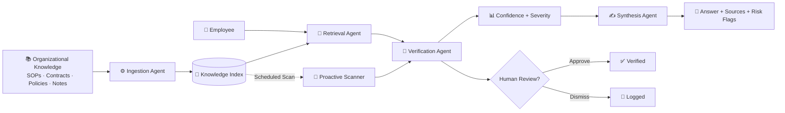

# 🧠 Think9 Brain

### **The Institutional Memory Layer for Multi-Brand Organizations**

> **What if your organization could remember every decision — and automatically catch when its own policies stop agreeing?**

**Think9 AI & Intelligence Challenge · Track 3 — Decision Velocity & Institutional Memory**

[](#) [](#) [](#) [](#)

---

## ⚡ The Idea

As Think9 scales across **30+ brands**, institutional knowledge becomes fragmented across:

`SOPs` · `Contracts` · `Policies` · `Meeting Notes` · `Vendor Agreements` · `Past Decisions`

Traditional RAG answers:

> **"What does this document say?"**

Think9 Brain answers something more valuable:

> **"What did we decide, does everything still agree, and is there anything we should worry about?"**

### From Reactive Search → Proactive Intelligence

```text
                 ┌──────────────────────┐
                 │  Organizational      │
                 │      Knowledge       │
                 └──────────┬───────────┘
                            ↓
                 ┌──────────────────────┐
                 │   Think9 Brain 🧠    │
                 └──────────┬───────────┘
                            ↓
              ┌─────────────┼─────────────┐
              ↓             ↓             ↓
         🔎 Retrieve    🧩 Verify     🚨 Detect
         knowledge     policies      conflicts
              │             │             │
              └─────────────┼─────────────┘
                            ↓
                 📊 Risk + Confidence
                            ↓
                    🧑‍⚖️ Human Review
```

---

# 🚨 The Problem

Multi-brand organizations face two expensive knowledge failures.

### Fragmented Memory

> *"What did we decide about this?"*

The answer may be buried inside a meeting note, old policy, or someone's memory.

### Silent Contradictions

A group policy can require **15-day returns**, while a brand policy says **7 days**.

Both documents exist.

Both are retrievable.

**But traditional search doesn't automatically tell you that they conflict.**

---

# 💡 What Think9 Brain Does

### 🔎 1. Remember

Retrieve decisions, policies and organizational context from across the knowledge base.

### 🧩 2. Reason

Cross-reference brand-level information against group-level policies and related sources.

### 🚨 3. Monitor

Scan the **entire corpus proactively**, even when nobody asks a question.

### 🧑‍⚖️ 4. Escalate

High-risk or uncertain findings are sent to a human reviewer instead of being silently accepted.

---

# 🏗️ Architecture



---

# 🤖 Multi-Agent Brain

| Agent                    | What it does                                         |
| ------------------------ | ---------------------------------------------------- |
| ⚙️ **Ingestion**         | Parses, chunks and tags organizational documents     |
| 🔎 **Retrieval**         | Finds relevant institutional knowledge               |
| 🧩 **Verification**      | Cross-checks policies and detects conflicts          |
| ✍️ **Synthesis**         | Produces grounded, source-aware answers              |
| 🚨 **Proactive Scanner** | Searches the entire corpus for hidden contradictions |
| 🧑‍⚖️ **Human Review**   | Approves or dismisses high-impact findings           |

### Authority-aware reasoning

The system understands that:

```text
Group Policy
      ↓
Master Agreement
      ↓
Brand Policy
      ↓
Operational Exception
```

So it doesn't simply ask:

> *"Are these texts similar?"*

It asks:

> **"Do these policies agree, and which one has higher organizational authority?"**

---

# 🔥 The POC "Wow" Moment

The prototype contains **10 mock organizational documents** with intentionally seeded conflicts.

### Example

```text
GROUP POLICY
Return window → 15 days
        │
        │  ⚠️ CONFLICT
        ↓
BRAND B
Return window → 7 days
```

Another:

```text
GROUP PROCUREMENT
Payment terms → Net-30
        │
        │  ⚠️ CONFLICT
        ↓
BRAND C
Payment terms → Net-45
```

### Full-Corpus Scan

Instead of asking six different questions:

> **Scan Entire Corpus → 10 documents → 6 contradictions discovered**

```text
┌─────────────────────────────┐
│     PROACTIVE SCAN 🧠       │
├─────────────────────────────┤
│ Documents scanned       10  │
│ Contradictions found     6  │
│ High severity            2  │
│ Medium severity          4  │
└─────────────────────────────┘
```

> **The system found problems before anyone asked about them.**

*Results are from the included synthetic POC dataset and are not production accuracy benchmarks.*

---

# 🛠️ Built With

| Layer                     | Technology                                     |
| ------------------------- | ---------------------------------------------- |
| **Backend**               | FastAPI                                        |
| **RAG / Retrieval**       | Python + TF-IDF                                |
| **Index**                 | Local vector/index layer                       |
| **LLM**                   | Claude API *(optional)*                        |
| **Frontend**              | HTML + CSS + JavaScript                        |
| **Production Direction**  | LangGraph + pgvector + modern embedding models |
| **Integration Direction** | Slack · Email · MCP                            |

The POC is intentionally lightweight and runs locally without requiring a complex cloud stack.

---

# 📁 Project Structure

```text
think9-brain-poc/
│
├── 📂 data/                 # Organizational knowledge corpus
├── 📂 static/
│   └── index.html           # Chat + proactive dashboard
│
├── ⚙️ app.py                # FastAPI application
├── 🧠 rag.py                # Retrieval + reasoning engine
├── 📥 ingest.py             # Document ingestion pipeline
├── 📦 requirements.txt
├── 🗃️ index.pkl             # Generated knowledge index
└── 📖 README.md
```

---

# 🚀 Run Locally

### Requirements

* Python **3.10+**
* Git
* Windows, macOS, or Linux

### 1. Clone

```bash
git clone https://github.com/AatifaRizvi/think9-brain-poc.git
cd think9-brain-poc
```

### 2. Create environment

**Windows**

```powershell
python -m venv .venv
.venv\Scripts\activate
```

**macOS / Linux**

```bash
python3 -m venv .venv
source .venv/bin/activate
```

### 3. Install

```bash
pip install -r requirements.txt
```

### 4. Build the index

```bash
python ingest.py
```

### 5. Start Brain

```bash
uvicorn app:app --reload --port 8000
```

Open:

**http://localhost:8000**

---

# 🎬 Try It

### Ask the Brain

```text
What is BrandB's return policy and is it compliant?
```

or

```text
What are BrandC's vendor payment terms?
```

### Then trigger the wow moment:

> **🚨 Scan Entire Corpus**

Watch Think9 Brain discover contradictions **without being told what to look for.**

---

# 🔌 API

| Endpoint            | Purpose               |
| ------------------- | --------------------- |
| `GET /`             | Web application       |
| `POST /query`       | RAG + verification    |
| `GET /scan-all`     | Proactive corpus scan |
| `POST /flag-review` | Human review          |

The backend is API-first, allowing the UI to be replaced with React, Slack, or another enterprise interface without changing the reasoning layer.

---

# 🗺️ From POC → Production

### Current POC

```text
Local Documents
      ↓
Lightweight Retrieval
      ↓
Contradiction Engine
      ↓
Web Dashboard
```

### Production Vision

```text
Drive · Slack · Email · CRM · Internal Systems
                    ↓
            Secure Ingestion
                    ↓
        Metadata + Versioning + ACL
                    ↓
         PostgreSQL + pgvector
                    ↓
       Multi-Agent Reasoning Layer
                    ↓
       ┌────────────┼────────────┐
       ↓            ↓            ↓
    Answers      Alerts       What-if
       │            │         Simulation
       └────────────┼────────────┘
                    ↓
             Human Governance
```

### 30-Day MVP Path

| Week   | Focus                                             |
| ------ | ------------------------------------------------- |
| **01** | Connect 2–3 pilot brands + real knowledge sources |
| **02** | Production ingestion + embeddings + pgvector      |
| **03** | Contradiction engine + reviewer workflow          |
| **04** | Pilot deployment + evaluation + tuning            |

---

# 🔮 What's Next?

### ⏳ Temporal Drift

Detect policies that were marked **temporary** but were never revisited.

### 🔮 What-If Simulation

> *"What happens if BrandE changes its return policy to 10 days?"*

Identify conflicts **before** a new policy goes live.

### 🔗 Enterprise Integrations

Bring the Brain into the tools where decisions already happen:

**Slack · Email · Google Drive · Microsoft 365 · MCP**

---

# 🔐 Production Readiness Direction

The prototype intentionally focuses on the reasoning workflow.

A production deployment would add:

* 🔒 Role-based access control
* 🏢 Brand-level data isolation
* 📜 Document versioning
* 🔍 Full audit trails
* 🛡️ PII / sensitive-data controls
* 👥 Reviewer permissions
* 📈 Observability & evaluation
* 🤖 Model monitoring

---

# 🧠 The Bigger Vision

Think9 Brain is not another document chatbot.

It is a step toward an **organizational memory layer** that continuously understands:

```text
What did we decide?
        ↓
Why did we decide it?
        ↓
Is the decision still valid?
        ↓
Does anything else contradict it?
        ↓
Who needs to know?
```

> ### **From searching organizational knowledge → to continuously reasoning across it.**

**Remember decisions. Detect contradictions. Accelerate the next decision.**

---

## 🎥 Demo

**Demo Video:** *Add link before submission*

Recommended flow:

**Ask → Retrieve → Verify → Detect → Scan Entire Corpus → Review**

---

### 🏆 Think9 AI & Intelligence Challenge

**Track 3 — Decision Velocity & Institutional Memory**

**Think9 Brain · Institutional Memory + Proactive Decision Intelligence**
