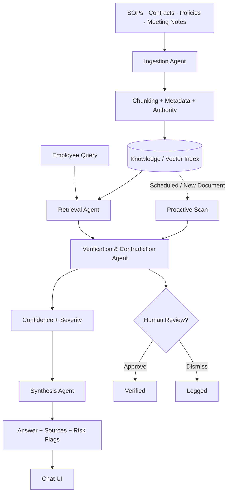

# 🧠 Think9 Brain

### Institutional Memory & Proactive Decision Intelligence for Multi-Brand Organizations

> **Think9 Brain transforms fragmented organizational knowledge into an active decision-support system — retrieving institutional memory, cross-checking policies, and proactively surfacing contradictions before they become business risks.**

**Think9 AI & Intelligence Challenge · Track 3 — Decision Velocity & Institutional Memory**

---

## 🚀 What is Think9 Brain?

As organizations scale across brands, critical knowledge gets scattered across SOPs, contracts, meeting notes, vendor policies, and historical decisions.

Traditional search and RAG systems answer questions **when someone asks**.

**Think9 Brain goes one step further: it continuously reasons across the knowledge base to detect contradictions proactively.**

### Core capabilities

* 🔎 **Institutional-memory RAG** — retrieve decisions, policies, and context
* 🧩 **Cross-document reasoning** — compare brand and group-level policies
* 🚨 **Proactive contradiction detection** — scan the entire corpus without a query
* 📊 **Confidence & severity scoring** — prioritize important findings
* 🧑‍⚖️ **Human-in-the-loop review** — approve or dismiss high-impact findings
* 📚 **Source-aware answers** — keep responses grounded in organizational documents

---

# 🎯 The Problem

Multi-brand organizations face two recurring problems:

### 1. Fragmented Institutional Memory

> *"What did we decide about this?"*

Important decisions may exist only in meeting notes, documents, or individual memory.

### 2. Silent Policy Contradictions

A brand-level policy may conflict with a group-level requirement without anyone noticing.

**Example:**

```text
Group Policy → Minimum return window: 15 days
       ↓
BrandB Policy → Return window: 7 days  ⚠️
```

Finding both documents is easy.

**Recognizing that they conflict is the real problem.**

---

# 🧠 How It Works

Think9 Brain operates in two modes:

### Reactive Intelligence

```text
Employee Query
      ↓
Retrieval
      ↓
Policy Verification
      ↓
Contradiction Detection
      ↓
Answer + Sources + Risk Flags
```

### Proactive Intelligence

```text
Entire Knowledge Corpus
          ↓
Cross-document Analysis
          ↓
Contradiction Detection
          ↓
Confidence + Severity
          ↓
Human Review
```

> **The key differentiator: the Brain can find problems even when nobody asks a question.**

---

# 🏗️ Architecture



---

# 🤖 Agent Architecture

| Agent              | Role                                                                              |
| ------------------ | --------------------------------------------------------------------------------- |
| **Ingestion**      | Parses, chunks, and tags documents with brand, type, date, and authority metadata |
| **Retrieval**      | Finds relevant institutional knowledge                                            |
| **Verification**   | Cross-checks policies and detects conflicts                                       |
| **Synthesis**      | Generates concise, source-aware answers                                           |
| **Proactive Scan** | Scans the complete corpus without a user query                                    |
| **Human Review**   | Approves or dismisses high-impact findings                                        |

The system also distinguishes between:

```text
Group Policy
     ↓
Master Agreement
     ↓
Brand Policy
     ↓
Operational Exception
```

This makes contradiction detection **authority-aware**, rather than simple keyword matching.

---

# 📊 Proof of Concept

The repository contains a runnable prototype with **10 mock Think9-style documents** covering brand policies, group policies, agreements, procurement rules, meeting notes, and HR information.

### Seeded conflicts

**Return Policy**

```text
Group minimum : 15 days
BrandB        : 7 days
```

**Vendor Payment**

```text
Group policy : Net-30
BrandC       : Net-45
```

### Prototype results

| Metric               | Result |
| -------------------- | -----: |
| Documents scanned    | **10** |
| Contradictions found |  **6** |
| High severity        |  **2** |
| Medium severity      |  **4** |

> Results are from the included synthetic POC corpus and are **not production accuracy benchmarks**.

---

# 🛠️ Tech Stack

| Layer         | POC                     | Production Direction        |
| ------------- | ----------------------- | --------------------------- |
| Backend       | FastAPI                 | Scalable FastAPI services   |
| Retrieval     | TF-IDF                  | Sentence Transformers + ANN |
| Storage       | Local pickle index      | PostgreSQL + pgvector       |
| Generation    | Optional Claude API     | Structured-output LLM       |
| Frontend      | HTML / JS               | React + Vite + Tailwind     |
| Orchestration | Python agent boundaries | LangGraph                   |
| Integration   | REST API                | Slack / Email / MCP         |

The lightweight POC keeps infrastructure minimal while preserving clear interfaces for production upgrades.

---

# 📁 Project Structure

```text
think9-brain-poc/
│
├── data/                 # Mock organizational documents
├── static/
│   └── index.html        # Chat + proactive dashboard
│
├── app.py                # FastAPI backend & endpoints
├── rag.py                # Retrieval + verification + scanning
├── ingest.py             # Document ingestion & indexing
├── requirements.txt      # Dependencies
├── index.pkl             # Generated local index
└── README.md
```

### Core API

| Endpoint            | Purpose                          |
| ------------------- | -------------------------------- |
| `GET /`             | Web application                  |
| `POST /query`       | Query + retrieval + verification |
| `GET /scan-all`     | Full-corpus contradiction scan   |
| `POST /flag-review` | Human review decision            |

---

# ⚡ Quick Start

```bash
git clone https://github.com/AatifaRizvi/think9-brain-poc.git
cd think9-brain-poc

python -m venv .venv
```

### Windows

```powershell
.venv\Scripts\activate
pip install -r requirements.txt
python ingest.py
uvicorn app:app --reload --port 8000
```

Open:

```text
http://localhost:8000
```

Try:

```text
"What is BrandB's return policy and is it compliant?"
```

Or click:

> **Scan Entire Corpus**

to discover contradictions without asking a question.

---

# 🗺️ 30-Day MVP Roadmap

| Week  | Focus               | Deliverable                               |
| ----- | ------------------- | ----------------------------------------- |
| **1** | Data + pilot brands | Real corpus + metadata model              |
| **2** | Production RAG      | Embeddings + pgvector + retrieval         |
| **3** | Verification        | Contradiction engine + reviewer dashboard |
| **4** | Pilot rollout       | Real users + threshold tuning + feedback  |

---

# 🔮 What's Next?

### Temporal Drift Detection

Detect temporary policy exceptions that become outdated or remain unresolved.

### What-If Policy Simulation

Before publishing a policy:

> *"If BrandE changes its return window to 10 days, what does it conflict with?"*

### Enterprise Integrations

Connect institutional intelligence to:

* Slack
* Email
* Google Drive
* Microsoft 365
* Internal knowledge systems
* MCP-based tools

---

# 🔐 Production Considerations

A production deployment would add:

* Role-based access control
* Brand/document-level permissions
* Document versioning
* Audit logs
* PII protection
* Model-output monitoring
* Human approval for high-impact decisions

The current repository is a **proof of concept**, not an enterprise production deployment.

---

# 💡 Why Think9 Brain?

Traditional RAG:

```text
Question → Retrieve → Answer
```

Think9 Brain:

```text
Knowledge
    ↓
Retrieve
    ↓
Reason Across Sources
    ↓
Detect Contradictions
    ↓
Prioritize Risk
    ↓
Human Decision
```

> **From searching organizational knowledge → to continuously reasoning across it.**

The goal is simple:

### **Remember what was decided.**

### **Detect when things stop agreeing.**

### **Help teams make the next decision faster.**

---

## 🎥 Demo

**Demo Video:** *Add link before submission*

Recommended flow:

**Query → Sources → Contradiction → Scan Entire Corpus → Review Finding**

---

### Built for the Think9 AI & Intelligence Challenge

**Track 3 — Decision Velocity & Institutional Memory**

**Think9 Brain · Institutional Memory + Proactive Decision Intelligence**
